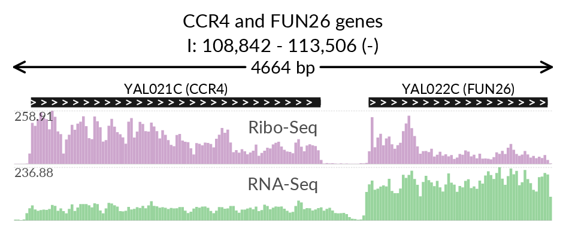

***

## Description

Svist4get is a simple bioinformatics tool for visualization of genomic signal tracks in user-defined genomic windows, either arbitrary selected by genomic coordinates or anchored to particular transcripts or genes.

**Supported genomic signal tracks:** bedGraph  
**Supported genome annotation:** GTF (Ensembl or GENCODE)  
**Supported output:** vector (pdf) and raster (png)  
**Programming language:** Python 3  
**OS:** Linux, Mac OS  
**Python dependencies:** reportlab, statistics, biopython, configs, wand, argparse, pybedtools  
**OS-level dependencies:** bedtools, ImageMagick (pdf-to-png conversion)  
**License:** [WTFPL](http://www.wtfpl.net)

---

## Installation

You need those tools at the OS level (probably installable as Linux packages):
**bedtools** and **ImageMagick**
(Ubuntu users, please consult [FAQ](docs/FAQ.md) regarding possible issues with ImageMagick).


- The most stable release of svist4get can be installed directly from pypi:

```
python3 -m pip install svist4get
```

- The development version is available at bitbucket :

```
git clone https://artegorov@bitbucket.org/artegorov/svist4get.git
cd svist4get
python3 -m pip install --upgrade pip
python3 -m pip install wheel
python3 setup.py sdist bdist_wheel
python3 -m pip install -e .
```


---

## Contact

Please contact us by e-mail _artyom**dot**egorov**AT**belozersky**dot**msu**dot**ru_ or use Issues to report any technical problems.  
Old [Issues page](https://bitbucket.org/artegorov/svist4get/issues) from bitbucket.

---

## Image example





##### Console commands to reproduce the above image


```
svist4get --sampledata
```

```
svist4get -bg svist4get_data/RiboCov_cut.bedGraph svist4get_data/mRNACov_cut.bedGraph \
-gtf svist4get_data/S.cerevisiae.gtf -fa svist4get_data/S.cerevisiae.dna.fa \ 
-bl Ribo-Seq RNA-Seq -w I 108842 113506 -it "CCR4 and FUN26 genes" -rc -c A4_p1
```
---
## Reference

If you find svist4get useful, please cite:


Artyom A. Egorov, Ekaterina A. Sakharova, Aleksandra S. Anisimova, Sergey E. Dmitriev, Vadim N. Gladyshev and Ivan V. Kulakovskiy,  
**svist4get: a simple visualization tool for genomic tracks from sequencing experiments,**  
*BMC Bioinformatics, Volume 20, 2019, 113, [doi: 10.1186/s12859-019-2706-8](https://doi.org/10.1186/s12859-019-2706-8)*

---

## Detailed documentation

#### [Quickstart guide](docs/QSGUIDE.md)  
#### [Command-line parameters](docs/PARAMETERS.md)  
#### [Configuration file parameters](docs/CONFIG.md)  
#### [API usage examples](docs/API.md)  
#### [FAQ](docs/FAQ.md)  
#### [Version log](docs/VERSION.md)
---

## Known issues

- Older versions of pybedtools (the necessary package) may fail to compile under Python 3.7. Usage of Python 3.6 is thus advised.

- GTF annotations other than Ensembl and GENCODE may be parsed incorrectly in some cases. Usage of those annotation sources is advised.

- pdf-to-png conversion may fail in some OS/ImageMagick combinations. Please consult [FAQ](docs/FAQ.md) for details.


---

## Authors

svist4get is developed by Artyom Egorov _artem**dot**egorov**AT**med**dot**lu**dot**se_ at the Laboratory of Systems Biology of Aging, MSU (Current address: [The Atkinson Lab](https://atkinson-lab.com), Department of Experimental Medical Science, Lund University). We are open for suggestions to extend and improve svist4get functionality. Please don't hesitate to share your ideas or feature requests.

 *svist4get logo drawn by E. Kulakovskaya based on puppy named Cindy of [S. Anisimova](https://scholar.google.ru/citations?user=4GJj7S0AAAAJ&hl=en)

---


## Applications/Citations 

More than 20 citations according to [Google Scholar](https://scholar.google.com/scholar?oi=bibs&hl=en&authuser=1&cites=8975441885381696257).

---
