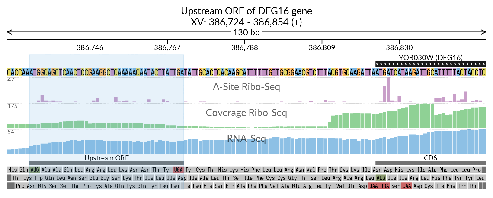

# API usage examples

___
Short example-drived guide to svist4get API 
Svist4get has a simple API allowing it programmatic usage from within a Python program. Below we descrive several Python snippets that mimic results of [command-line calls](QSGUIDE.md).


Here we present several examples of svist4get vizualizations and the respective code snippets using svist4get API. The examples are based on the yeast sample data from [GWIPs](https://gwips.ucc.ie/cgi-bin/hgTrackUi?hgsid=70860_dNAywxoBvAFoARLEit7wULCJbfKz&c=chrI&g=Albert14_RiboProElong), the necessary data samples as well as the yeast genome annotation from [Ensembl](https://www.ensembl.org/Saccharomyces_cerevisiae/Info/Index) are provided by svist4get at the post-install step:

`svist4get -sampledata`


---
## Transcript-centric visualization


```python

import svist4get as sv4g

# loading data, parameters initialization
path_to_config = './svist4get_data/A4_p1.cfg'
pa = sv4g.manager.Parameters()
pa.initialize(path_to_config)
pa.config['transcript_id'] = 'YFL031W'
paths_to_bedgraphs = ['./svist4get_data/RiboProElong_cut.bedGraph',
                     './svist4get_data/RiboCov_cut.bedGraph',
                     './svist4get_data/mRNACov_cut.bedGraph']
pa.config['bedgraph'] = paths_to_bedgraphs
pa.config['gtf_file'] = './svist4get_data/S.cerevisiae.gtf'
pa.config['fasta_file'] = './svist4get_data/S.cerevisiae.dna.fa'
pa.config['image_title'] = 'Gene HAC1'
pa.config['bedgraph_label'] = ['A-Site Ribo-Seq', 'Coverage Ribo-Seq', 'RNA-Seq']
pa.config['hide_introns'] = 1
pa.config['output_filename'] = './API_case1'

# gtf data extraction
gtf = sv4g.data_processing.Gtf_helper(pa.config['gtf_file'])
data_from_gtf = (gtf.extract_data_about_transcripts(pa.config['transcript_id']))
pa.add_gtf_data(data_from_gtf)

# creating a list of tracks
tracks = []
tracks += sv4g.manager.Title_tracks_maker(pa).create_tracks()
tracks += sv4g.manager.Axis_tics_tracks_maker(pa).create_tracks()
tracks += sv4g.manager.Vgrid_tracks_maker(pa).create_tracks()
tracks += sv4g.manager.Transcript_struct_tracks_maker(pa).create_tracks()
tracks += sv4g.manager.Bedgraph_tracks_maker(pa).create_tracks()
tracks += sv4g.manager.Aa_seq_tracks_maker(pa).create_tracks()

# saving image to the pdf file specified in parameters
sv4g.manager.Image(tracks, pa).draw()

# converting the resulting pdf to a png file
sv4g.methods.pdf_page_to_png(pa)

```


---

## Visualization anchored at the translation initiation site

```python

import svist4get as sv4g

# loading data, parameters initialization
path_to_config = './svist4get_data/A4_p2.cfg'
pa = sv4g.manager.Parameters()
pa.initialize(path_to_config)
pa.config['transcript_id'] = 'YOR030W'
pa.config['window'] = ['tis', 100, 30]
paths_to_bedgraphs = ['./svist4get_data/RiboProElong_cut.bedGraph',
                     './svist4get_data/RiboCov_cut.bedGraph',
                     './svist4get_data/mRNACov_cut.bedGraph']
pa.config['bedgraph'] = paths_to_bedgraphs
pa.config['gtf_file'] = './svist4get_data/S.cerevisiae.gtf'
pa.config['fasta_file'] = './svist4get_data/S.cerevisiae.dna.fa'
pa.config['image_title'] = 'Upstream ORF of DFG16 gene'
pa.config['bedgraph_label'] = ['A-Site Ribo-Seq', 'Coverage Ribo-Seq', 'RNA-Seq']
pa.config['output_filename'] = './API_case2'
pa.config['genomic_intervals'] = [['386730-386772'], ['386824-386999']]
pa.config['genomic_intervals_label'] = ['Upstream ORF', 'CDS']
pa.config['highlight_frame'] = [[386730, 386772, ' ']]

# gtf data extraction
gtf = sv4g.data_processing.Gtf_helper(pa.config['gtf_file'])
data_from_gtf = gtf.extract_data_around_ts(pa.config['transcript_id'], pa.config['window'])
pa.add_gtf_data(data_from_gtf)

# creating a list of tracks
tracks = []

tracks += sv4g.manager.Title_tracks_maker(pa).create_tracks()
tracks += sv4g.manager.Axis_tics_tracks_maker(pa).create_tracks()
tracks += sv4g.manager.Vgrid_tracks_maker(pa).create_tracks()
tracks += sv4g.manager.Nt_seq_tracks_maker(pa).create_tracks()
tracks += sv4g.manager.Transcript_struct_tracks_maker(pa).create_tracks()
tracks += sv4g.manager.Bedgraph_tracks_maker(pa).create_tracks()
tracks += sv4g.manager.Genomic_intervals_tracks_maker(pa).create_tracks()
tracks += sv4g.manager.Aa_seq_tracks_maker(pa).create_tracks()

# saving image to the pdf file specified in parameters
sv4g.manager.Image(tracks, pa).draw()

# converting the resulting pdf to a png file
sv4g.methods.pdf_page_to_png(pa)

```



---
## Gene-centric selection of a genomic window

```python
 
import svist4get as sv4g

# loading data, parameters initialization
path_to_config = './svist4get_data/A4_p1.cfg'
pa = sv4g.manager.Parameters()
pa.initialize(path_to_config)
pa.config['gene_id'] = 'YFL031W'
paths_to_bedgraphs = ['./svist4get_data/RiboProElong_cut.bedGraph',
                     './svist4get_data/RiboCov_cut.bedGraph',
                     './svist4get_data/mRNACov_cut.bedGraph']
pa.config['bedgraph'] = paths_to_bedgraphs
pa.config['gtf_file'] = './svist4get_data/S.cerevisiae.gtf'
pa.config['fasta_file'] = './svist4get_data/S.cerevisiae.dna.fa'
pa.config['image_title'] = 'Gene HAC1'
pa.config['bedgraph_label'] = ['A-Site Ribo-Seq', 'Coverage Ribo-Seq', 'RNA-Seq']
pa.config['highlight_frame'] = [[75839, 76091, 'intron']]
pa.config['output_filename'] = './API_case3'

# gtf data extraction
gtf = sv4g.data_processing.Gtf_helper(pa.config['gtf_file'])
coordinates = gtf.extract_window_from_gene_id(pa.config['gene_id'])
transcripts = gtf.extract_transcripts_from_widnow(*coordinates)
data_from_gtf = (gtf.extract_data_about_transcripts(transcripts))
pa.add_gtf_data(data_from_gtf)

# creating a list of tracks
tracks = []
tracks += sv4g.manager.Title_tracks_maker(pa).create_tracks()
tracks += sv4g.manager.Axis_tics_tracks_maker(pa).create_tracks()
tracks += sv4g.manager.Vgrid_tracks_maker(pa).create_tracks()
tracks += sv4g.manager.Transcript_struct_tracks_maker(pa).create_tracks()
tracks += sv4g.manager.Bedgraph_tracks_maker(pa).create_tracks()
tracks += sv4g.manager.Aa_seq_tracks_maker(pa).create_tracks()

# saving image to the pdf file specified in parameters
sv4g.manager.Image(tracks, pa).draw()

# converting the resulting pdf to a png file
sv4g.methods.pdf_page_to_png(pa)


```


---
## An arbitrary genomic window

```python

import svist4get as sv4g

# loading data, parameters initialization
path_to_config = './svist4get_data/A4_p1.cfg'
pa = sv4g.manager.Parameters()
pa.initialize(path_to_config)
pa.config['window'] = ['I', 108842, 113506]
paths_to_bedgraphs = ['./svist4get_data/RiboProElong_cut.bedGraph',
                     './svist4get_data/RiboCov_cut.bedGraph',
                     './svist4get_data/mRNACov_cut.bedGraph']
pa.config['bedgraph'] = paths_to_bedgraphs
pa.config['gtf_file'] = './svist4get_data/S.cerevisiae.gtf'
pa.config['fasta_file'] = './svist4get_data/S.cerevisiae.dna.fa'
pa.config['image_title'] = 'CCR4 and FUN26 genes'
pa.config['bedgraph_label'] = ['A-Site Ribo-Seq', 'Coverage Ribo-Seq', 'RNA-Seq']
pa.config['output_filename'] = './API_case4'
pa.config['revcomp_transform'] = 1

# gtf data extraction
gtf = sv4g.data_processing.Gtf_helper(pa.config['gtf_file'])
transcripts = gtf.extract_transcripts_from_widnow(*pa.config['window'])
data_from_gtf = (gtf.extract_data_about_transcripts(transcripts))
pa.add_gtf_data(data_from_gtf)

# creating a list of tracks
tracks = []
tracks += sv4g.manager.Title_tracks_maker(pa).create_tracks()
tracks += sv4g.manager.Axis_tics_tracks_maker(pa).create_tracks()
tracks += sv4g.manager.Vgrid_tracks_maker(pa).create_tracks()
tracks += sv4g.manager.Transcript_struct_tracks_maker(pa).create_tracks()
tracks += sv4g.manager.Bedgraph_tracks_maker(pa).create_tracks()
tracks += sv4g.manager.Aa_seq_tracks_maker(pa).create_tracks()

# saving image to the pdf file specified in parameters
sv4g.manager.Image(tracks, pa).draw()

# converting the resulting pdf to a png file
sv4g.methods.pdf_page_to_png(pa)

```


---

## Usage of paired bedGraph tracks


```python

import svist4get as sv4g

# loading data, parameters initialization
path_to_config = 'svist4get_data/alt_A4_p1.cfg'
pa = sv4g.manager.Parameters()
pa.initialize(path_to_config)
pa.config['window'] = ['V01313.1', 390, 2430]

paths_to_bedgraphs = [['svist4get_data/mata_ribo1_plus.bedGraph', 'svist4get_data/mata_ribo1_minus.bedGraph'],
                      ['svist4get_data/mata_ribo2_plus.bedGraph', 'svist4get_data/mata_ribo2_minus.bedGraph'],
                      ['svist4get_data/mata_rna1_plus.bedGraph', 'svist4get_data/mata_rna1_minus.bedGraph'],
                      ['svist4get_data/mata_rna2_plus.bedGraph', 'svist4get_data/mata_rna2_minus.bedGraph']]
pa.config['paired_bedgraph'] = paths_to_bedgraphs
pa.config['bedgraph'] = paths_to_bedgraphs
pa.config['gtf_file'] = 'svist4get_data/MATa.gtf'
pa.config['fasta_file'] = 'svist4get_data/MATa.fasta'
pa.config['image_title'] = 'MAT locus of MATa yeast strain'
pa.config['bedgraph_label'] = ['Ribo-Seq (sample1)', 'Ribo-Seq (sample2)', 'RNA-Seq (sample1)', 'RNA-Seq (sample2)']
pa.config['output_filename'] = './MATA_API'
pa.config['revcomp_transform'] = 1
pa.config['c_bedgraph_tracks'] = ['brightorange', 'brightorange', 'purple', 'purple']
pa.config['highlight_frame'] = [[1224, 1305, ''], [1533, 1638, 'Translated open reading frames'], [1692, 1932, '']]

# gtf data extraction
gtf = sv4g.data_processing.Gtf_helper(pa.config['gtf_file'])
transcripts = gtf.extract_transcripts_from_widnow(*pa.config['window'])
data_from_gtf = (gtf.extract_data_about_transcripts(transcripts))
pa.add_gtf_data(data_from_gtf)

# creating a list of tracks
tracks = []
tracks += sv4g.manager.Title_tracks_maker(pa).create_tracks()
tracks += sv4g.manager.Axis_tics_tracks_maker(pa).create_tracks()
tracks += sv4g.manager.Vgrid_tracks_maker(pa).create_tracks()
tracks += sv4g.manager.Transcript_struct_tracks_maker(pa).create_tracks()
tracks += sv4g.manager.Genomic_intervals_tracks_maker(pa).create_tracks()
tracks += sv4g.manager.Paired_bedgraph_tracks_maker(pa).create_tracks()

# saving image to the pdf file specified in parameters
sv4g.manager.Image(tracks, pa).draw()

# converting the resulting pdf to a png file
sv4g.methods.pdf_page_to_png(pa)


```


---
### [Main page](../README.md)


#### [Quickstart guide](./QSGUIDE.md)

#### [Command-line parameters](./PARAMETERS.md)

#### [Configuration file parameters](./CONFIG.md)

#### [FAQ](./FAQ.md)

#### [Version log](./VERSION.md)


