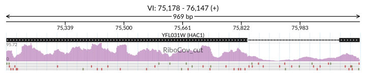
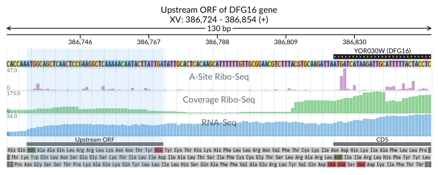
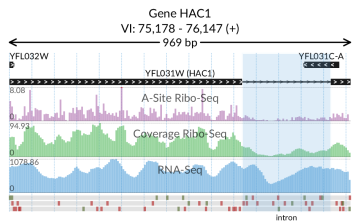
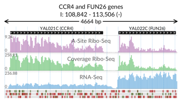
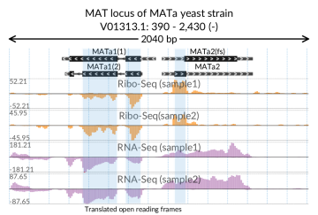

# Quickstart guide

___

Here we present several examples of svist4get vizualizations and the respective command-line parameters. The examples are based on the yeast sample data from [GWIPs](https://gwips.ucc.ie/cgi-bin/hgTrackUi?hgsid=70860_dNAywxoBvAFoARLEit7wULCJbfKz&c=chrI&g=Albert14_RiboProElong), the necessary data samples as well as the yeast genome annotation from [Ensembl](https://www.ensembl.org/Saccharomyces_cerevisiae/Info/Index) are provided by svist4get at the post-install step:

```
svist4get -sampledata
```

---
## Transcript-centric visualization

###### Simple example with minimal agruments


```
svist4get -gtf svist4get_data/S.cerevisiae.gtf -fa svist4get_data/S.cerevisiae.dna.fa -bg svist4get_data/RiboCov_cut.bedGraph -t YFL031W
```




###### Example with optional arguments


```
svist4get -gtf svist4get_data/S.cerevisiae.gtf -fa svist4get_data/S.cerevisiae.dna.fa -bg svist4get_data/RiboProElong_cut.bedGraph svist4get_data/RiboCov_cut.bedGraph svist4get_data/mRNACov_cut.bedGraph -t YFL031W -it 'Gene HAC1' -bl 'A-Site Ribo-Seq' 'Coverage Ribo-Seq' 'RNA-Seq' -hi -hrf 0 -c A4_p1
```


---

## Visualization anchored at the translation initiation site

```
svist4get -gtf svist4get_data/S.cerevisiae.gtf -fa svist4get_data/S.cerevisiae.dna.fa -bg svist4get_data/RiboProElong_cut.bedGraph svist4get_data/RiboCov_cut.bedGraph svist4get_data/mRNACov_cut.bedGraph -bl 'A-Site Ribo-Seq' 'Coverage Ribo-Seq' 'RNA-Seq' -t YOR030W -w tis 100 30 -it 'Upstream ORF of DFG16 gene' -gi 386730-386772 -gi 386824-386999 -gil 'Upstream ORF' 'CDS' -hf 386730 386772 ' '
```



---
## Gene-centric selection of a genomic window

```
svist4get -gtf svist4get_data/S.cerevisiae.gtf -fa svist4get_data/S.cerevisiae.dna.fa -bg svist4get_data/RiboProElong_cut.bedGraph svist4get_data/RiboCov_cut.bedGraph svist4get_data/mRNACov_cut.bedGraph -bl 'A-Site Ribo-Seq' 'Coverage Ribo-Seq' 'RNA-Seq' -g YFL031W -it 'Gene HAC1' -hf 75839 76091 intron -c svist4get_data/A4_p1.cfg -o HAC1
```



---
## An arbitrary genomic window

```
svist4get -gtf svist4get_data/S.cerevisiae.gtf -fa svist4get_data/S.cerevisiae.dna.fa -bg svist4get_data/RiboProElong_cut.bedGraph svist4get_data/RiboCov_cut.bedGraph svist4get_data/mRNACov_cut.bedGraph -bl 'A-Site Ribo-Seq' 'Coverage Ribo-Seq' 'RNA-Seq' -w I 108842 113506 -it 'CCR4 and FUN26 genes' -rc  -c svist4get_data/A4_p1.cfg
```



---
## Usage of paired bedGraph tracks


```
svist4get -gtf svist4get_data/MATa.gtf -fa svist4get_data/MATa.fasta -pbg svist4get_data/mata_ribo1_plus.bedGraph svist4get_data/mata_ribo1_minus.bedGraph -pbg svist4get_data/mata_ribo2_plus.bedGraph svist4get_data/mata_ribo2_minus.bedGraph -pbg svist4get_data/mata_rna1_plus.bedGraph svist4get_data/mata_rna1_minus.bedGraph -pbg svist4get_data/mata_rna2_plus.bedGraph svist4get_data/mata_rna2_minus.bedGraph -w V01313.1 390 2430 -rc -it 'MAT locus of MATa yeast strain' -bl 'Ribo-Seq (sample1)' 'Ribo-Seq(sample2)' 'RNA-Seq (sample1)' 'RNA-Seq (sample2)' -bgc brightorange brightorange purple purple -c svist4get_data/alt_A4_p1.cfg -hf 1224 1305 ' ' -hf 1533 1638 'Translated open reading frames' -hf 1692 1932 ' '
```



___

**Note**: the displayed range of bedGraph signal values (Y axis) depends on the genomic window width, due to the profile smoothing procedure that, by default, aggregates and averages values for each displayed 'bar'. Processing is not used for small genomic windows that allow bedGraph tracks to be plotted in single-nucleotide resolution. Alternative processing functions are possible: min, max, median, or none (displays raw data). The function can be set using `-bgb` command line or 'bedgraph_bar' config parameters, see also the detailed help pages.


---
### [Main page](../README.md)


#### [Command-line parameters](./PARAMETERS.md)

#### [Configuration file parameters](./CONFIG.md)

#### [API usage examples](./API.md)

#### [FAQ](./FAQ.md)

#### [Version log](./VERSION.md)

